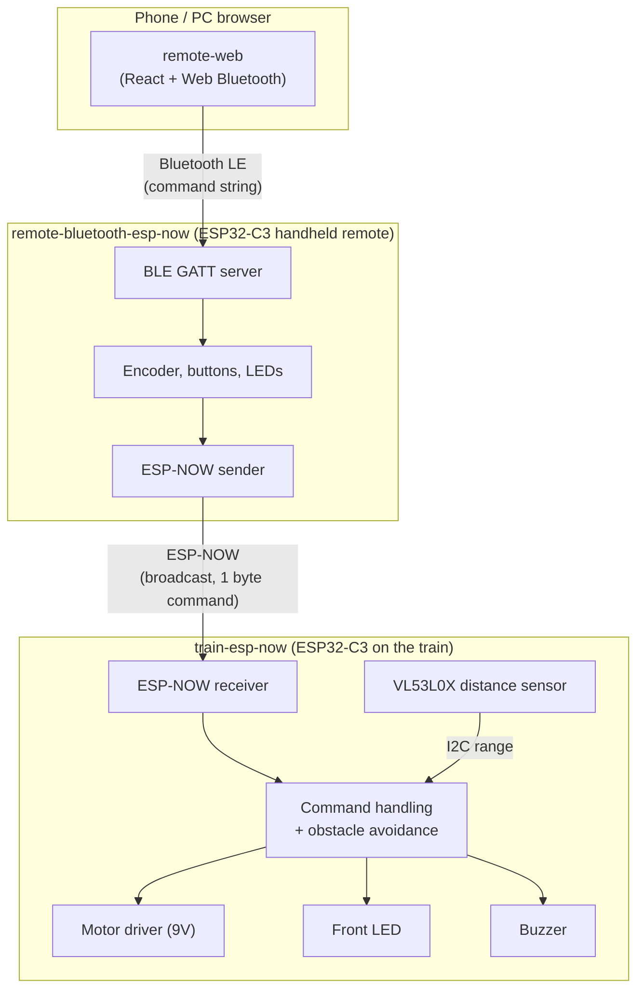
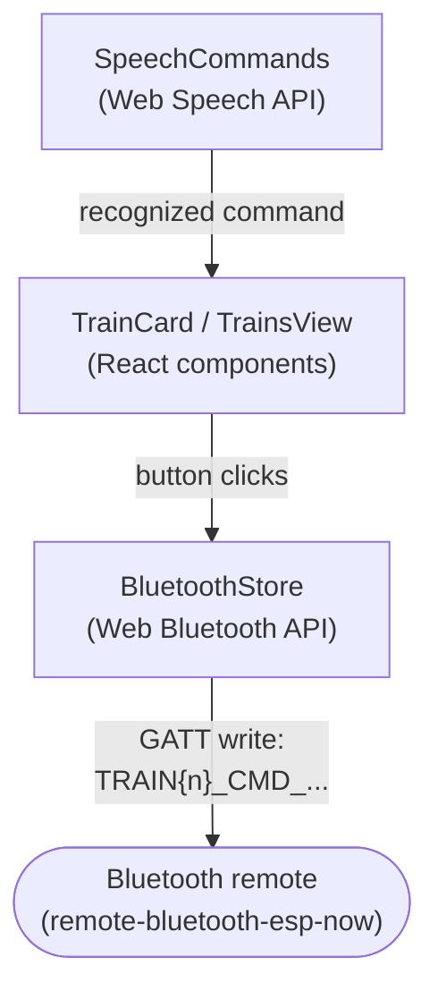
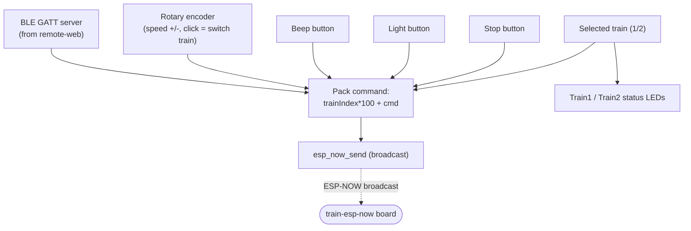
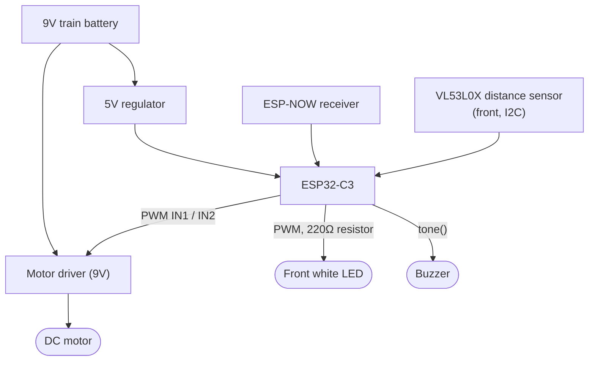

# Trains Arduino

A remote-control system for LEGO trains, built around ESP32-C3 boards and ESP-NOW radio.
A web page (or phone browser) talks to a handheld remote over Bluetooth, the remote
forwards commands over ESP-NOW to the train board, and the train board drives the
motor, lights, buzzer and a front-facing distance sensor for auto-stop.

## Projects

| Project | What it is | Platform |
|---|---|---|
| [`train-esp-now`](train-esp-now) | Onboard controller mounted in the LEGO train | ESP32-C3, PlatformIO/Arduino |
| [`remote-bluetooth-esp-now`](remote-bluetooth-esp-now) | Handheld remote control | ESP32-C3, PlatformIO/Arduino |
| [`remote-web`](remote-web) | Web app (desktop or phone) that sends commands to the remote over Bluetooth | React + TypeScript, Web Bluetooth API |

## Overall architecture

Two trains (green and blue) can be controlled independently. Each command carries a
train index, so both the remote and the train board only act on messages addressed to
the currently selected train.

## remote-web

React + TypeScript single-page app, connects to the remote over the Web Bluetooth API
and sends text commands such as `TRAIN1_CMD_SPEED_UP`. It also supports voice commands
(Web Speech API) in English and Russian, mapped per-train (e.g. "green faster" / "синий
стоп").

Commands sent: `CMD_BEEP`, `CMD_STOP`, `CMD_SPEED_UP`, `CMD_SPEED_DOWN`, `CMD_LIGHT_TOGGLE`.

## remote-bluetooth-esp-now (handheld remote)

Receives commands from the web app over Bluetooth LE (as a GATT server) and re-sends
them over ESP-NOW (broadcast, no pairing) to whichever train is currently selected.
Also has its own physical controls: a rotary encoder (speed up/down, click to switch
train) and three buttons (beep, light, stop), plus a status LED per train.

### Wiring (remote-bluetooth-esp-now)

| Function | Pin | Notes |
|---|---|---|
| Encoder A / B | GPIO4 / GPIO3 | Rotation, speed up/down |
| Encoder click | GPIO1 | Switch selected train |
| Beep button | GPIO0 | Pulled up, active low |
| Light button | GPIO7 | Pulled up, active low |
| Stop button | GPIO6 | Pulled up, active low |
| Train 1 (green) status LED | GPIO20 | Through 220 Ω resistor |
| Train 2 (blue) status LED | GPIO21 | Through 220 Ω resistor |
| Onboard status LED | GPIO8 | Lit while idle, off briefly on command send |

## train-esp-now (onboard controller)

Sits on the train, receives commands over ESP-NOW and drives the hardware:

- **Motor**: 9V DC motor driver, two PWM outputs (one per direction) act as a simple
  H-bridge control (IN1/IN2). Speed is ramped in 15 levels with an "easy start" boost
  so the train reliably gets moving, especially with a trailer attached.
- **Front light**: white LED at the front of the train, through a 220 Ω resistor,
  toggled by `CMD_LIGHT_TOGGLE`.
- **Buzzer**: sounds a tone on `CMD_BEEP`.
- **Distance sensor**: VL53L0X time-of-flight sensor mounted at the front, polled over
  I2C. If an obstacle gets closer than ~150mm the train automatically slows down, and
  under ~100mm it stops, regardless of remote commands.
- **Power**: powered from the train's own 9V battery. A 5V regulator steps that down
  to power the ESP32-C3 board; the motor driver is fed the raw 9V directly.

### Wiring (train-esp-now)

| Function | Pin | Notes |
|---|---|---|
| Motor driver IN1 | GPIO10 | PWM, forward |
| Motor driver IN2 | GPIO5 | PWM, reverse |
| Front white LED | GPIO2 | Through 220 Ω resistor, PWM brightness |
| Buzzer | GPIO0 | `tone()`/`noTone()` |
| Distance sensor SDA | GPIO1 | VL53L0X, front-facing |
| Distance sensor SCL | GPIO4 | VL53L0X, front-facing |
| Onboard status LED | GPIO8 | Lit briefly on command received |

Two boards are flashed from the same firmware with `CURRENT_TRAIN_INDEX` set to `1`
(green) or `2` (blue), so each train only reacts to commands addressed to it.

## Command set

Both boards share the same command codes, sent as `trainIndex * 100 + command`:

| Command | Code | Effect |
|---|---|---|
| `CMD_BEEP` | 1 | Sound the buzzer |
| `CMD_STOP` | 2 | Stop the motor |
| `CMD_SPEED_UP` | 3 | Increase speed one level (max 15) |
| `CMD_SPEED_DOWN` | 4 | Decrease speed one level (max 15 in reverse) |
| `CMD_LIGHT_TOGGLE` | 7 | Toggle the front light |
